<!-- class: invert -->

# A journey through DMA
## Or why you should totally let me plug a device in your PCIe slot

By Auri/h33p
github.com/h33p/dma\_talks

---

# What is all this?

* Access RAM directly
* Target does not know about access
* Target can not restrict access

---

# But why?

---

## Game hacking

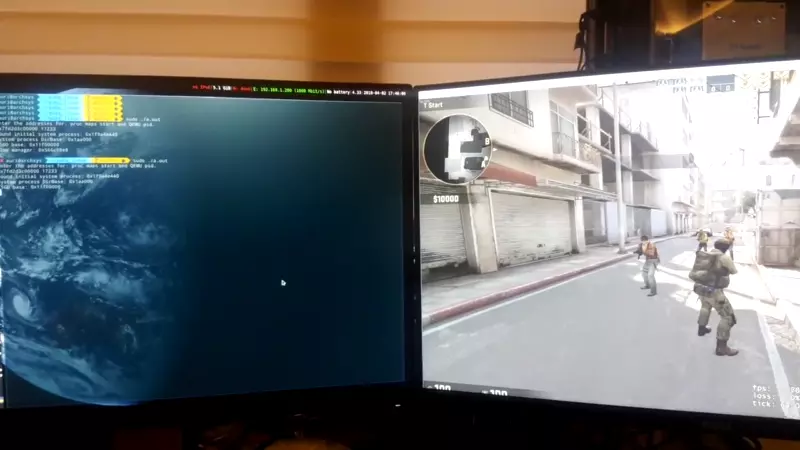

---

## Espionage

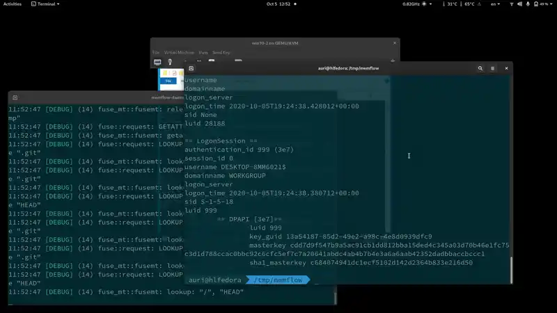

---

## And more

* Monitoring viruses
* Viruses
* Other 4D chess moves

---

# Ways to do DMA

* PCILeech
* VMs (QEMU/KVM, VBox, etc.)
* Local access (/dev/mem, MmMapIOSpace, WinDBG)

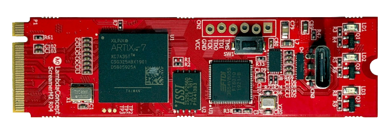

---

# Exhibit A: Changing a flag

---

# Dumping a process?

## not so fast!

* Virtual memory adds layers to this...

---

# Virtual memory

* Not mapped 1-to-1
* 4Kb per "page"
* 256TB of addressible memory per process
* We don't have 256TB of memory... Yet...

---

# Address translation

* Example - 0xa3c1a00596
* Binary - 0b1010001111000001101000000000010110010110
* Split it into 5 parts sized \[9\] \[9\] \[9\] \[9\] \[12\]
  * \[1\] \[010001111\] \[000001101\] \[000000000\] \[010110010110\]
  * Decimal - \[1\] \[143\] \[13\] \[0\] \[1430\]

---

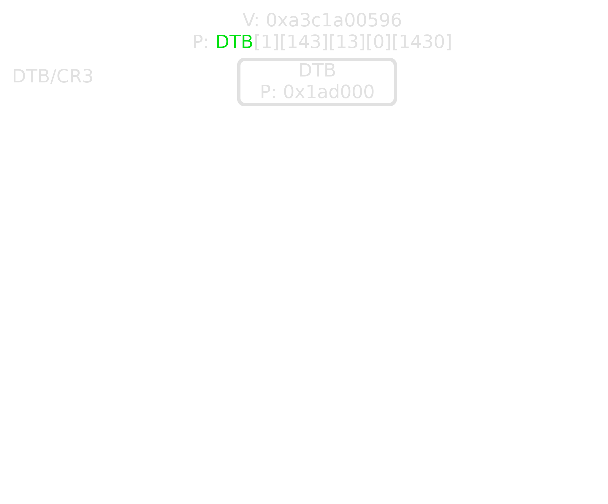

---

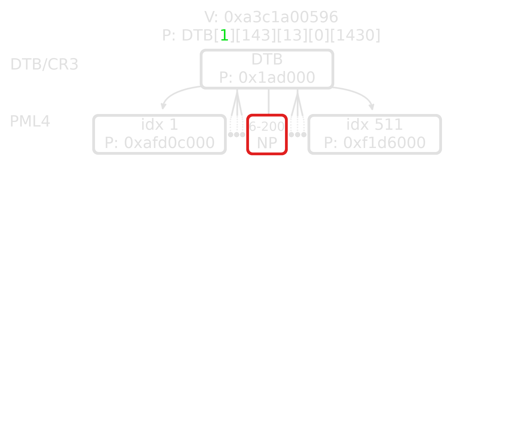

---

---

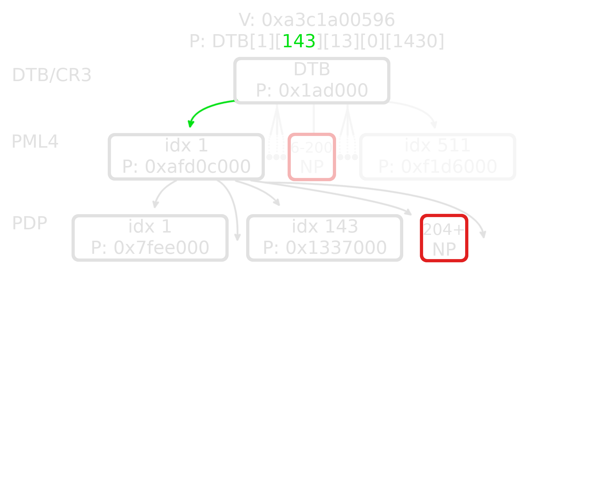

---

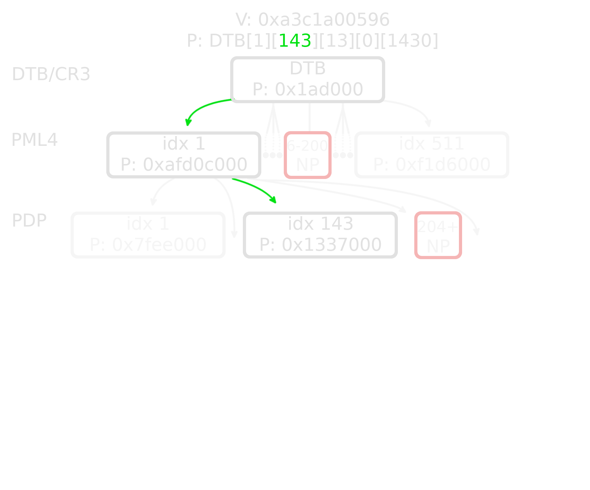

---

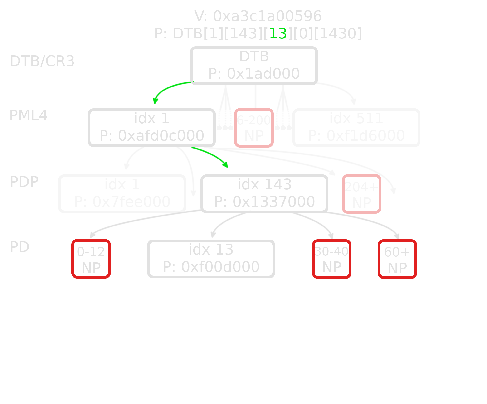

---

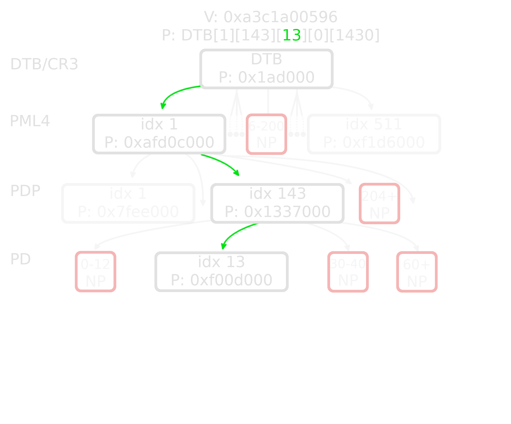

---

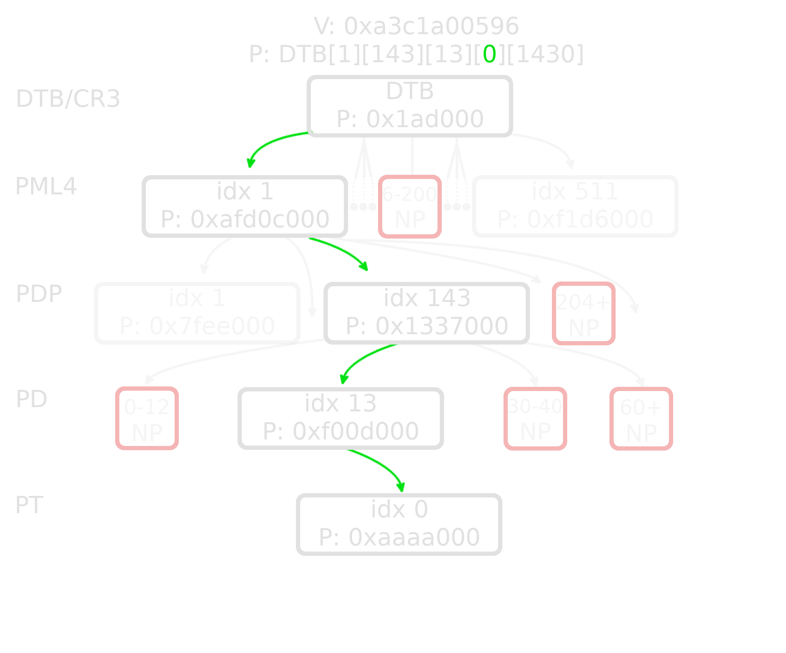

---

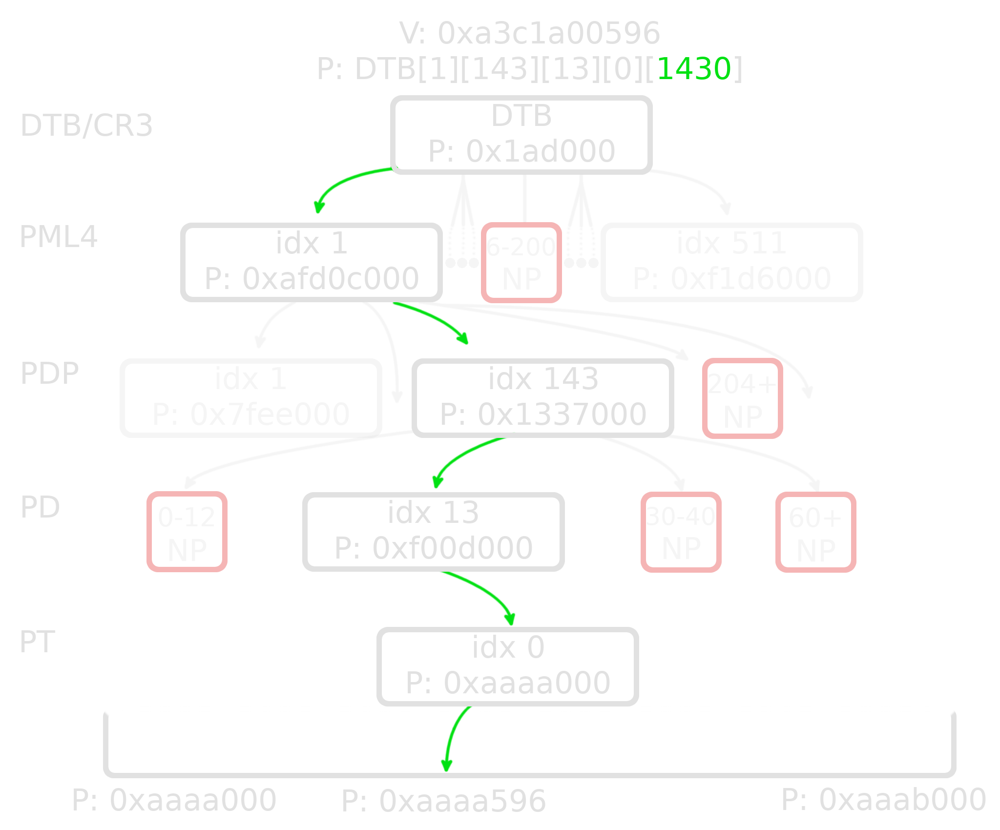

---

# Dumping a process?

## not so fast!

* Virtual memory adds layers to this...
* Where is the process?
* Where is Windows?
* Where am I?
* Why am I?

---

# Let's find out where the hell Windows is!

---

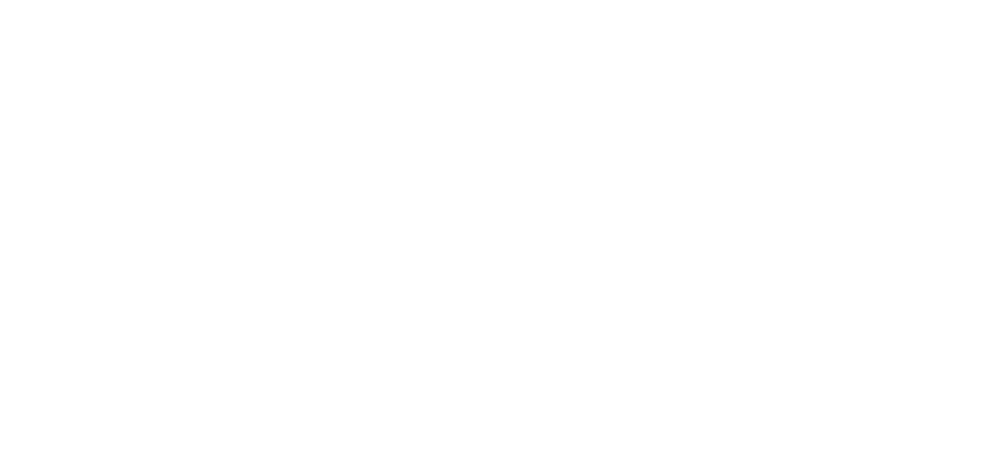

---

---

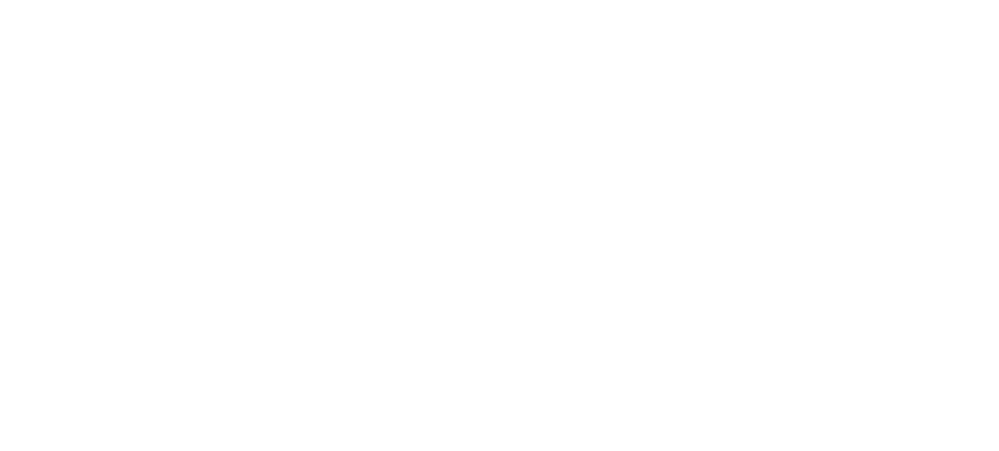

---

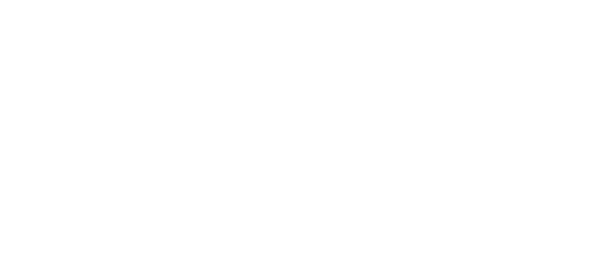

---

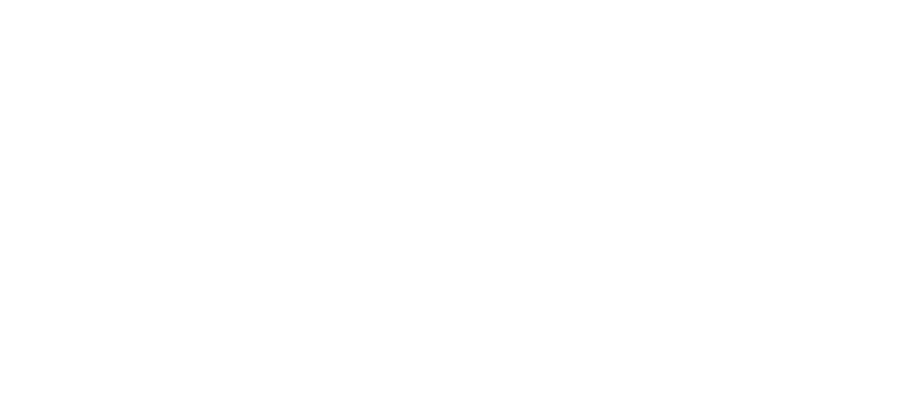

---

# Voila!

---

# memflow

* Meant to make this process easy
* Works on QEMU/KVM, Coredumps
* Easy to extend

---

# Exhibit B: Dumping login passwords

---

# Silver bullet?

## No!

* Page files
* No simple code execution

---

# Enough for some insane things?

## Hell yeah!

---

# So should you totally let me plug a device in your PCIe slot?

* Exercise left to the reader

---

# Some links

* github.com/ufrisk - Ulf Frisk, the man who started it all
* memflow.github.io - memflow homepage
* youtube.com/h33p\_tech - my YT with tutorials

